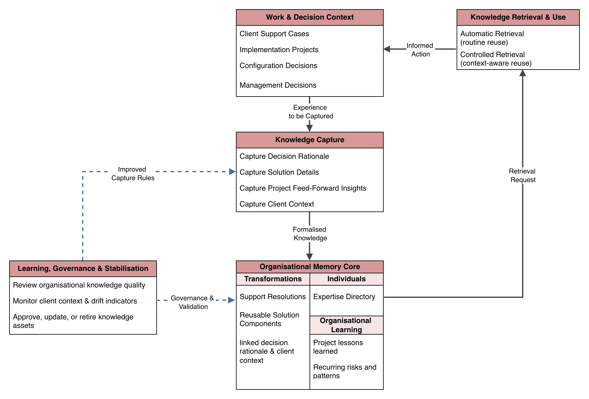

# Capstone Project — Organisational Memory Model for ERP Consultancy (Itelligence Case Study)

This project develops a conceptual organisational memory framework using **Itelligence**, an ERP consultancy, as a case study.  
The goal is to reduce repeated work, preserve expertise, and improve decision-making by transforming individual knowledge into reusable organisational knowledge.

Although designed around Itelligence’s workflows, the model is intended to be transferable to similar small and medium IT consultancies.

---

## The Problem
At Itelligence, knowledge was primarily stored in employees rather than systems.

This resulted in:
* Rebuilding the same solutions multiple times
* Slow support responses
* Inconsistent project outcomes
* Knowledge loss when staff leave

The challenge was to design a practical organisational memory model that captures and reuses knowledge without requiring complex infrastructure.

---

## Project Structure

### Objective 1 — Understanding Organisational Memory
* Systematic literature review on organisational memory and knowledge reuse
* Established links to efficiency, consistency, and innovation
* Identified lack of practical models for SME IT consultancies

---

### Objective 2 — Evaluating Existing Models
Compared major organisational memory approaches:

* Structural retention frameworks
* System-centric repositories
* Transactive memory (expert networks)
* Project learning models
* Context-aware memory approaches

**Finding:** Existing models were either too technical, too rigid, or unrealistic for SME environments → a tailored hybrid model was required.

---

### Objective 3 — Identifying Critical Knowledge
Validated through organisational workflows and staff input.

Six key knowledge elements:

* **Decision Rationale** — why a solution was chosen
* **Reusable Solution Components** — scripts & configurations
* **Support Resolutions** — recurring issue fixes
* **Expertise Directory** — locating tacit knowledge
* **Project Feed-Forward Insights** — lessons learned
* **Client Context & Drift Indicators** — detecting obsolete knowledge

---

### Objective 4 — Conceptual Model Design
Designed a layered organisational memory model integrating workflows and business intelligence concepts:

1. Work & decision context  
2. Knowledge capture and enrichment  
3. Organisational memory core  
4. Retrieval and operational use  
5. Learning and governance  

#### Conceptual Organisational Memory Model

The model connects daily operations with long-term organisational learning.

---

## Presentation
Project walkthrough and explanation:

---

## Key Skills & Techniques
* Qualitative case study research
* Systematic literature review
* Knowledge modelling & conceptual design
* Thematic interview analysis
* Workflow integration design

---

## Core Concepts
* Knowledge reuse vs knowledge loss
* Tacit and explicit knowledge integration
* Decision context preservation
* Organisational learning cycles
* Knowledge governance

---

## Key Outcomes
* Reduced dependency on individual expertise
* Structured reuse of technical solutions
* Faster support decision-making
* Prevention of repeated work

While developed for **Itelligence**, the framework provides a practical blueprint for similar IT consultancies to convert operational experience into a sustainable organisational asset.

